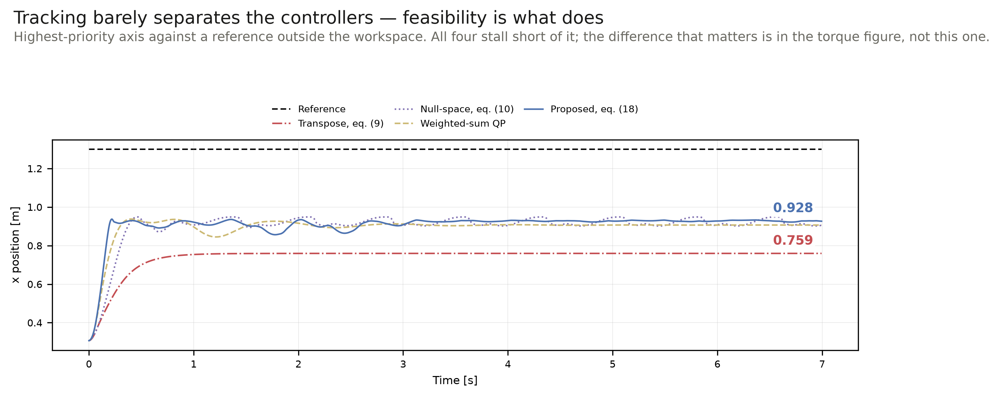
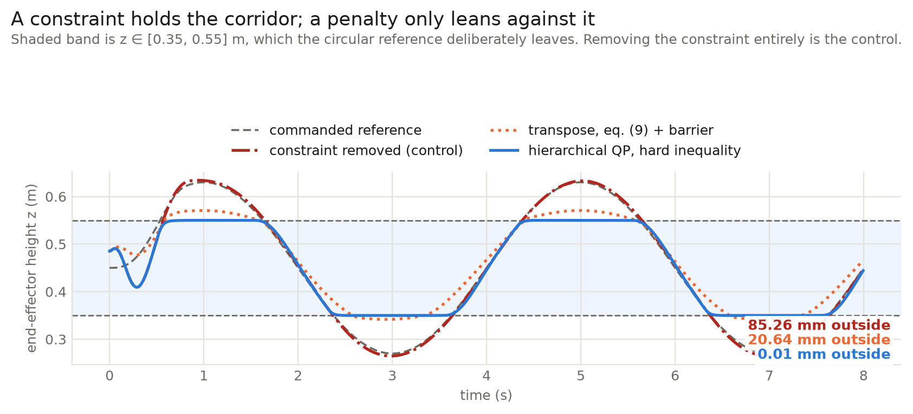
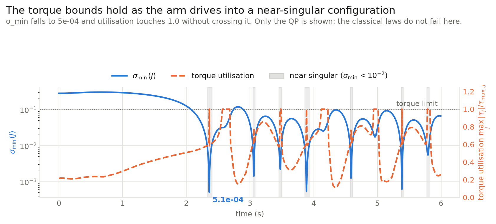

# Multi-Priority Cartesian Impedance Control (QP)

Implementation and evaluation of a Quadratic Programming (QP)-based hierarchical Cartesian impedance controller with joint-torque constraints for redundant manipulators.

Based on the paper:
> **Multi-Priority Cartesian Impedance Control Based on Quadratic Programming Optimization**  
> Enrico Mingo Hoffman, Arturo Laurenzi, Luca Muratore, Nikos G. Tsagarakis, and Darwin G. Caldwell  
> *IEEE International Conference on Robotics and Automation (ICRA), 2018*  
> [DOI: 10.1109/ICRA.2018.8462877](https://doi.org/10.1109/ICRA.2018.8462877)

---

## Key Features & Implementation Highlights

- **Hierarchical QP Structure:** Formulates multi-task priority levels as a cascade of Quadratic Programs operating directly in joint-torque space $\tau \in \mathbb{R}^n$, avoiding full Inverse Dynamics optimization over joint accelerations and contact force variables.
- **Pseudo-Inverse Free Formulation:** Eliminates expensive matrix pseudo-inversions ($\bar{J}$) within the QP objective functions by exploiting the unconstrained optimality condition $J B^{-1} \tau = J B^{-1} J^T f$.
- **Strict Joint Torque Saturation Bounds:** Enforces joint-torque saturation limits ($\tau_{\min} - h \le \tau \le \tau_{\max} - h$) directly inside the optimization problem to respect motor hardware limits.
- **Pre-Compiled CasADi Solver Engine:** Pre-compiles parametric CasADi C-functions using the `qpOASES` active-set solver (with automatic `OSQP` fallback) for real-time control capability.
- **Modular Task Hierarchy Stack:** Object-oriented task stack abstraction supporting arbitrary combinations of 3D/6D Cartesian pose impedance tasks, Virtual Model Control (VMC), full mass matrix ($\Lambda$) impedance, and joint space posture tasks.
- **Genesis Physics Integration:** Decoupled environment layer using the [Genesis physics engine](https://github.com/Genesis-Embodied-AI/Genesis) for a 7-DOF Franka Emika Panda manipulator (`panda_cylinder.xml`).

---

## Codebase Architecture

```
.
├── main.py                     # Entry point: simulation control loop, scenarios & experiment benchmarks
├── run_all_experiments.py      # Master benchmark runner executing all 10 evaluation experiments
├── pyproject.toml              # Project metadata & dependencies (genesis-world, casadi, qpsolvers, torch)
├── panda_cylinder.xml          # Franka Emika Panda 7-DOF MJCF robot model
├── controllers/
│   ├── __init__.py
│   ├── base_controller.py      # Abstract base class interface for robot controllers
│   ├── qp_impedance.py         # Multi-Priority Hierarchical QP Cartesian Impedance Controller (Eq. 18)
│   ├── classical_transpose.py  # Classical Jacobian Transpose Impedance Controller (Eq. 9)
│   ├── saturated_algebraic.py  # Saturated Algebraic Null-Space Controller with Post-Hoc Clipping (Eq. 10)
│   └── weighted_qp.py          # Single-Level Weighted-Sum QP Controller
├── solvers/
│   ├── __init__.py
│   └── casadi_qp_solver.py     # Pre-compiled parametric CasADi QP solver module (qpOASES / OSQP / DAQP)
├── tasks/
│   ├── __init__.py
│   ├── base_task.py            # Abstract base class for prioritizable control tasks
│   ├── cartesian_task.py       # Cartesian 3D position / 6D pose impedance task (VMC & Full Impedance)
│   ├── posture_task.py         # Joint-space null-space posture stiffness task
│   ├── force_task.py           # Cartesian force control task & circular trajectory generator
│   ├── apf_task.py             # Artificial Potential Field (APF) obstacle repulsion task
│   └── task_stack.py           # Priority-ordered task stack manager
├── experiments/
│   ├── __init__.py
│   ├── exp1_surface_circle.py  # Exp 1: Surface circular tracking & normal force exertion
│   ├── exp2_blocked_circle.py  # Exp 2: Blocked circular tracking & compliant obstacle contact
│   ├── exp3_apf_avoidance.py   # Exp 3: Reactive APF obstacle avoidance
│   ├── exp4_multilink_push.py  # Exp 4: Multi-link external disturbance rejection
│   ├── exp5_torque_constrained_wipe.py # Exp 5: Torque-constrained surface wiping
│   ├── exp6_singularity_tracking.py    # Exp 6: Kinematic singularity tracking & damping
│   ├── exp7_baseline_comparison.py     # Exp 7: 4-Way baseline comparison (Hoffman et al. Figs 1-4)
│   ├── exp8_frequency_bode_analysis.py # Exp 8: Frequency response & Bode bandwidth
│   ├── exp9_passivity_energy_profiling.py # Exp 9: Energy tank & passivity profiling
│   ├── exp10_parameter_robustness.py   # Exp 10: Model parameter uncertainty robustness
│   ├── exp11_cartesian_corridor_circle.py # Exp 11: Prioritized Z-corridor & out-of-bounds circle
│   └── benchmark_solver_latency.py     # Real-time solver latency profiling (< 0.5 ms @ 200 Hz)
├── utils/
│   ├── __init__.py
│   └── math_utils.py           # Dynamically consistent pseudo-inverses, null-space projectors, 6D pose error
├── scripts/
│   ├── plot_results.py         # Telemetry comparison plotting for conflict scenarios
│   └── probe_genesis.py        # Diagnostic probe for Genesis physics & MuJoCo shadow dynamics
└── envs/
    ├── __init__.py
    └── genesis_sim.py          # Genesis physics simulator wrapper with MuJoCo dynamics bridge
```

---

## Mathematical Formulation & Paper Alignment

### 1. Problem Definition & Operational Space Dynamics
For an $n$-DOF redundant manipulator with joint configuration vector $q \in \mathbb{R}^n$, task space coordinates $x = x(q) \in \mathbb{R}^m$ ($m < n$), and task Jacobian $J(q) = \frac{\partial x}{\partial q} \in \mathbb{R}^{m \times n}$, the joint-space dynamics in contact with the environment are:
$$B(q)\ddot{q} + h(q, \dot{q}) = \tau + J^T f_{\text{ext}}$$

where $B(q) \in \mathbb{R}^{n \times n}$ is the joint-space inertia matrix, $h(q, \dot{q}) = C(q, \dot{q})\dot{q} + g(q)$ is the vector of gravity and Coriolis/centrifugal forces, $\tau \in \mathbb{R}^n$ are joint torques, and $f_{\text{ext}}$ are external forces.

The relation between joint torques $\tau$ and task-space forces $f \in \mathbb{R}^m$ is:
$$\bar{J}^T \tau = f$$

where $\bar{J} = B^{-1} J^T (J B^{-1} J^T)^{-1}$ is the dynamically consistent pseudo-inverse.

### 2. Eliminating Matrix Pseudo-Inversion in QP Objectives
Classical formulations minimize $\|\bar{J}^T \tau - f\|^2$, requiring explicit evaluation of the dynamically consistent pseudo-inverse $\bar{J}$ inside the cost function.

By taking the derivative of the quadratic cost $F(\tau) = \frac{1}{2} \tau^T \bar{J} \bar{J}^T \tau - f^T \bar{J}^T \tau + \frac{1}{2} f^T f$, the optimality condition yields:
$$\frac{\partial F(\tau)}{\partial \tau} = \bar{J}\bar{J}^T \tau - \bar{J}f = 0 \implies J B^{-1} \tau = J B^{-1} J^T f$$

Thus, the single-task QP is reformulated without pseudo-inverses (Equation 16 in the paper):
$$\min_{\tau} \left\| J B^{-1} \tau - J B^{-1} J^T f \right\|^2$$

### 3. Hierarchical Prioritized QP Cascade
For multiple prioritized tasks ($0 = \text{highest priority}, 1, \dots$), the controller solves a cascade of QP optimization problems.

At priority level $i$, the optimal joint torques $\tau_i$ are obtained by solving (Equation 18 in the paper):
$$\arg\min_{\tau_i} \left\| J_i B^{-1} \tau_i - J_i B^{-1} J_i^T f_i \right\|^2 + \varepsilon \|\tau_i\|^2$$

$$\text{subject to:} \quad \tau_{\min} - h(q,\dot{q}) \le \tau_i \le \tau_{\max} - h(q,\dot{q})$$
$$J_{j} B^{-1} \tau_i = J_{j} B^{-1} \tau_j^* \quad \forall j \in \{0, \dots, i-1\}$$

where:
- $\varepsilon > 0$ is a regularization factor ensuring numeric stability near singularities.
- The linear equality constraints $J_j B^{-1} \tau_i = J_j B^{-1} \tau_j^*$ preserve the optimal task performance of higher-priority levels $j < i$.

### 4. Task Virtual Forces $f_i$
- **Virtual Model Control (VMC) / Simplified Spring-Damper (Equation 22):**
  $$f_{\text{cart}} = K_p (x_{\text{des}} - x) + K_d (\dot{x}_{\text{des}} - \dot{x})$$
- **Full Cartesian Impedance (Equation 23–24):**
  $$f_{\text{cart}} = \Lambda(q) \left(\ddot{x}_{\text{des}} - \dot{J}\dot{q}\right) + K_p (x_{\text{des}} - x) + K_d (\dot{x}_{\text{des}} - \dot{x})$$
  where $\Lambda(q) = (J B^{-1} J^T)^{-1}$ is the operational space mass matrix.
- **Null-Space Posture Task (Level 1, Equation 25):**
  $$\tau_{\text{null}} = K_{p,n} (q_{\text{null}} - q) - K_{d,n} \dot{q}$$

### 5. Feedforward Bias Compensation & Output Torques
The final output torque command sent to the actuators includes feedforward dynamics compensation (Equations 20–21):
$$\tau_{\text{cmd}} = \tau_{\text{opt}} + h(q, \dot{q})$$

---

## Setup & Execution

### 1. Prerequisites & Installation
This project uses [`uv`](https://github.com/astral-sh/uv) for environment and dependency management.

```bash
# Clone the repository
git clone https://github.com/lars-dell/Advanced-Robot-Control-Project.git
cd Advanced-Robot-Control-Project

# Create virtual environment and install dependencies from pyproject.toml
uv sync

# Activate virtual environment
# On Linux/macOS:
source .venv/bin/activate
# On Windows:
.venv\Scripts\activate
```

### 2. Running the Simulation Loop
Run the control simulation with interactive 3D rendering or headless:

```bash
# Run simulation with 3D GUI viewer (default: 5.0 seconds on the CPU backend)
uv run python main.py

# Run headless simulation (no visualizer window)
uv run python main.py --no-vis

# Run for 60 seconds so the viewer window stays open long enough to watch
uv run python main.py --time 60

# Run with the viewer but without any markers
uv run python main.py --no-markers
```

### Scenarios

`--experiment` (alias `--exp`) selects the priority hierarchy or experiment benchmark (default: `reach`). All use the same controller.

| Scenario | Priority levels | Reference | Purpose |
| :--- | :--- | :--- | :--- |
| `reach` | `cartesian (3-D) > posture` | reachable point | One Cartesian objective. Baseline. |
| `reach_split` | `x > y > z > posture` | the same reachable point | **Three Cartesian objectives at different priorities** (assignment requirement 2). Everything is satisfiable, so all three errors go to zero. |
| `conflict` | configurable, e.g. `x > y > z > posture` | `[1.30, 0.15, 0.75]` — **x out of reach**, y and z reachable | Objectives compete; the priority order decides who is sacrificed. |

`reach` and `reach_split` both converge to `0.0000 m`. That equivalence is the point of
`reach_split`: decomposing one 3-D objective into three ranked 1-D objectives reproduces the
undecomposed result exactly, which is only true if the cascade's priority constraints are correct.
Priority ordering has no *visible* effect there because nothing has to be given up — that requires
a conflicting reference.

#### Priority ordering decides who is sacrificed

In `conflict` the arm can extend to about `x = 0.93` while holding the commanded y and z, so the x
objective is permanently unsatisfiable while y and z are not. All three compete for one thing —
which direction the arm commits its reach to — and the ranking settles it:

| Priority order | x error | y error | z error | |
| :--- | ---: | ---: | ---: | :--- |
| `x > y > z` | **0.376** | 0.019 | 0.293 | x is protected, z absorbs the shortfall |
| `z > y > x` | 0.461 | 0.000 | **0.000** | z is satisfied exactly, x absorbs it instead |

<table>
<tr><th><code>--priority-order xyz</code></th><th><code>--priority-order zyx</code></th></tr>
<tr>
<td></td>
<td></td>
</tr>
<tr>
<td>Reach is prioritised: the arm commits further forward and lets the tip sag below the commanded height.</td>
<td>Height is prioritised: the tip holds the commanded z exactly and gives up reach instead.</td>
</tr>
</table>

Both clips are 7 s of the same scenario with the same controller, gains and target — only the
ranking differs. The green sphere is the (unreachable) target, the amber line is the tracking
error, and the cyan trail is the path of the tool tip.


The crossover between the first and third panels is the whole result. In **x**, blue (x on top)
settles *below* orange — 0.376 against 0.461. In **z** they invert: orange is flat at 0.000 while
blue oscillates around 0.293. The **y** panel shows both near zero, because y is satisfiable either
way and the ranking never has to decide anything.

Two honest caveats. Priority did not make x succeed — 0.376 is still a large error, because the
target is out of reach and no ranking can change physics. And the z trace under `x > y > z` never
settles; it oscillates for the full run rather than converging.


Every joint touches its bound at some point, so peak utilisation is 1.0 across the board and
carries no information; what varies is how long each stays there. Under `x > y > z` the shoulder
(J2) is pinned for **80%** of the run and the 12 N·m wrist joints J5/J6 for **53%** and **70%** —
the joints the lever-arm geometry predicts would saturate first. Every bar is far lower under
`z > y > x`: prioritising the unreachable objective costs much more actuator effort *and* gives a
worse overall outcome.

Across both runs there were **0 torque-limit violations in 2,800 control steps**, with no clipping
anywhere in the controller. That is the evidence for requirement 4 — feasibility comes from the QP
bounds of eq. (19)–(21), not from clamping the output.

Regenerate both figures from the logs with:

```bash
uv run python main.py --no-vis --time 7 --scenario conflict --priority-order xyz --out results/conflict_xyz.npz
uv run python main.py --no-vis --time 7 --scenario conflict --priority-order zyx --out results/conflict_zyx.npz
uv run python scripts/plot_results.py
```

```bash
uv run python main.py --scenario conflict --priority-order xyz
uv run python main.py --scenario conflict --priority-order zyx
```

Two things are worth reading off that table.

**Priority does not guarantee success, it guarantees non-interference.** At top priority x still
fails, with an error of 0.371 — the target is physically out of reach and no ranking can change
that. What the ranking bought is 0.371 instead of 0.461: nothing below x was permitted to make it
worse. A lower-priority task can never degrade a higher one.

**Ranking only matters between objectives that actually compete.** The y error is ~0 under both
orderings, because y = 0.15 is easy and there is enough freedom to satisfy it regardless of where
it sits in the stack.

A one-dimensional objective is expressed with `CartesianPoseTask(axes=[0])` (x only), `[1]` (y),
`[2]` (z). This is the decomposition Hoffman et al. use in section V-A.

### Visualization

When the viewer is open, the simulation draws what the controller is doing:

| Element | Appearance | Meaning |
| :--- | :--- | :--- |
| **Goal** | green glowing sphere (r = 2 cm) | Where the primary Cartesian task is aiming |
| **Error line** | amber line, tool tip → goal | **Its length _is_ the tracking error.** It shrinks to nothing as the arm converges |
| **Disturbance** | red arrow at the tool tip | The external force while it acts (2 cm of arrow per newton). Visible only during the t = 2.0–2.2 s push |
| **Trail** | cyan breadcrumbs, fading with age | Path the tool tip has travelled, including the kink where the disturbance knocked it off course |

Turn everything off with `--no-markers`.

Notes:
- Overlays are **viewer-only**. In a headless run (`--no-vis`) they are skipped entirely and cost
  nothing, so telemetry runs are unaffected.
- The goal marker is **massless and collision-free**, and the other three elements are debug-draw
  overlays rather than scene objects. None of them can perturb the physics — verified by comparing
  headless runs with markers on and off, which produce identical results.
- The overlays are redrawn every 5th control step (40 Hz at the default `dt`). Redrawing at the full
  200 Hz would take the viewer lock every step and measurably slow the simulation.

### CLI Command Line Arguments for `main.py`
| Argument | Type | Default | Description |
| :--- | :--- | :--- | :--- |
| `--time` | `float` | `5.0` | Total simulation duration in seconds. |
| `--dt` | `float` | `0.005` | Control loop timestep in seconds (200 Hz). |
| `--no-vis` | `flag` | `False` | Run in headless mode without 3D viewer window. |
| `--device` | `str` | `cpu` | Genesis physics backend (`cpu` or `gpu`). |
| `--no-markers` | `flag` | `False` | Disable the goal, error-line, disturbance and trail overlays. |
| `--out` | `str` | `results/run.npz` | Destination file for the telemetry log. |
| `--experiment`, `--exp` | `str` | `reach` | Experiment or priority scenario to run: scenarios (`reach`, `reach_split`, `conflict`) or benchmark suite (`surface_circle`, `blocked_circle`, `apf_avoidance`, `multilink_push`, `torque_wipe`, `singularity`, `baseline_comparison`, `bode`, `passivity`, `robustness`, `benchmark`, `all`). |
| `--priority-order` | `str` | `xyz` | Axis ranking in `conflict`, highest priority first (e.g. `xyz`, `zyx`). |
| `--record` | `str` | `None` | Record the run to a file, e.g. `docs/media/run.gif`. |

---

## Experiments behind the report

The benchmark suite below contains eleven experiments. **Five runs back a specific claim in the
report**; the rest are exploratory. This section says which is which, what each one demonstrates,
and what it does *not*.

All numbers were measured on 6 September 2026, on the `daqp` solver, and every one of them is
recorded with its provenance in `docs/EVALUATION_FRAMEWORK.md`.

### 1 · `conflict` — strict priority, and torque limits under load

```bash
uv run python main.py --no-vis --exp conflict --priority-order xyz --time 7
uv run python main.py --no-vis --exp conflict --priority-order zyx --time 7
```

Three one-dimensional Cartesian objectives compete for a target at 1.51 m, beyond the measured
reachable radius, so the ranking alone decides which is sacrificed. This one run carries most of the
report: requirements 2, 3, 4, 5 and 7.

| What | Measured |
| :--- | :--- |
| Priority residual `‖J_k B⁻¹(τ − τ*_k)‖` | **4.0·10⁻⁸** — against **72.1** for a weighted-sum QP solving the identical tasks with the identical solver |
| Priority swap | `x>y>z` → x 0.373 / z 0.324 &nbsp;·&nbsp; `z>y>x` → x 0.461 / z **0.0000** |
| Torque-limit violations | **0** in 1,400 steps, at a tolerance of 1·10⁻⁴ N·m, with no clipping |
| Constraint *activity* | ≥1 joint on a bound in **92.5 %** of steps |

The residual is the number that matters. It is what separates a hierarchy from a weighting.


**Note the logarithmic axis** — the two controllers are eleven orders of magnitude apart, solving
the same tasks with the same solver. The cascade holds a median residual of 1.9·10⁻¹¹, at solver
tolerance; the weighted-sum QP sits at 2.9, meaning it silently trades priority-0 accuracy away
whenever its weights favour doing so. This is the clearest single piece of evidence that the
hierarchy is enforced as a constraint rather than approximated by a cost.


Utilisation is `max_j |τ_j| / τ_max,j`, so unity *is* the bound and the shaded region is infeasible.
The proposed cascade rides the limit continuously without crossing it; the transpose law leaves the
feasible set; the weighted-sum QP never uses the budget available to it. The activity figure is separate from the violation
count on purpose — zero violations is equally consistent with "the limits worked" and "we never went
near them", and only the second number tells them apart.

**Caveat.** Priority does not make an unreachable task reachable. x still fails by 0.373 m even at
the top of the stack; what the ranking buys is 0.373 instead of 0.461.

### 2 · `compare` — against the three classical formulations

```bash
uv run python main.py --no-vis --exp compare --scenario conflict --priority-order xyz --time 7
```

The same task stack under four controllers, reproducing Figs. 1–4 of the paper. This is where the
Dietrich null-space method enters as the classical baseline the assignment suggests.

| Controller | P0 RMSE [m] | Violations | Max overshoot |
| :--- | ---: | ---: | ---: |
| **Hierarchical QP, eq. (18)** | **0.3981** | **0** | **0.00 N·m** |
| Weighted-sum QP | 0.4128 | 0 | 0.00 N·m |
| Null-space projection, eq. (10) | 0.4084 | 453 | 0.00 N·m |
| Classical transpose, eq. (9) | 0.5627 | 13 | **59.86 N·m** |

The transpose law exceeding its bound by 59.9 N·m is the paper's Fig. 1; the null-space method
violating on a third of steps is its Fig. 3.

**Caveat, and it matters.** The tracking advantage over the weighted-sum QP is **3.6 %** — within
what re-tuning either controller would produce. Do not read this table as "the QP tracks better". It
tracks about the same and is the only one that stays feasible.



All four are held short of the unreachable reference; the transpose law stalls furthest from it.
What the figure cannot show is the difference that matters — feasibility — which is the violation
column of the table above.

### 3 · `corridor` — the general inequality constraint of eq. (18)

```bash
uv run python main.py --no-vis --exp corridor
```

Everything above exercises the QP's *cost* and its *box bounds* on τ. Only this run uses the general
row `b_l ≤ Aτ ≤ b_u`. A height corridor z ∈ [0.35, 0.55] m is imposed while a circular reference
deliberately commands heights outside it.

| Configuration | Max excursion beyond the corridor |
| :--- | ---: |
| Hierarchical QP (hard inequality) | **0.01 mm** |
| Weighted-sum QP (hard inequality) | **0.01 mm** |
| Null-space, eq. (10) (barrier fallback) | 15.07 mm |
| Transpose, eq. (9) (barrier fallback) | 20.64 mm |
| **Constraint ablated entirely** | **84 mm** |

The ablation row is what makes the rest meaningful — without it, "the tool stayed inside" could just
mean the trajectory did. The classical laws cannot express an inequality at all, so the same
objective degrades to a barrier spring-damper for them.

Stiffening that barrier 33× narrows the gap to 0.92 mm, but only by commanding **103.5 N·m against
an 87 N·m limit** — it buys corridor accuracy by leaving the feasible set. That is the real point: a
penalty gives you accuracy *or* feasibility and lets you trade between them, while the QP satisfies
both because both are constraints.

**Caveat.** The control barrier function filling eq. (18)'s constraint slot is ours, not the
paper's — eq. (18) supplies the slot. And the constraint drops the convective `J̇q̇` term because
Genesis exposes no `J̇`, so the 0.01 mm is an empirical result, not a proof of a strict bound.



**The red trace is the control.** With the constraint removed the arm follows the reference straight
out of the corridor, which is what makes the other traces mean anything — otherwise "the tool stayed
inside" could simply be a trajectory that never left. The QP flattens exactly on the boundary and
resumes tracking on re-entry; the barrier fallback, which is the best a projection method can do
with an objective it cannot express as a constraint, overshoots on every excursion.

<p align="center">
  
</p>

The blue mesh is the ceiling at z = 0.55 m, the orange one the floor at 0.35 m; both are visual
markers with no collision geometry, so nothing mechanical stops the arm. **Watch the tool tip rise
until it meets the blue plane and then travel along it** while the commanded reference keeps
climbing past. Reproduce with:

```bash
uv run python main.py --exp corridor --record docs/media/corridor.gif --time 10
```

### 4 · `blocked_circle` — does the arm render the stiffness it was told to?

```bash
uv run python main.py --no-vis --exp blocked_circle
```

An obstacle the controller knows nothing about blocks a commanded circular path. In steady contact
the exerted force should equal the commanded stiffness times the deflection the task sees.

| Commanded `kp` [N/m] | Δx [mm] | F_x [N] | Rendered K [N/m] | ratio |
| ---: | ---: | ---: | ---: | ---: |
| 300 | 35.4 | 15.2 | 428 | 1.43 |
| 600 | 23.9 | 17.6 | 739 | 1.23 |
| 1200 | 16.2 | 22.9 | 1418 | 1.18 |

The sweep is the point: a single operating point would only show that *some* force appears. Across a
fourfold range the arm reproduces a *commanded* impedance. Surface friction was the obvious
contaminant and was tested — varying the normal press 12.5× moves the ratio only 9 %, so friction
explains almost none of the excess.

This run also answers something the paper does not address: the priority guarantee bounds the QP
solution, but says nothing about forces the controller never modelled. Measured through the
collision, the residual holds at **1.4·10⁻¹⁴** — machine precision, and six orders *tighter* than in
the free-space conflict scenario. Contact does not disturb the hierarchy; a heavily active
constraint set does.

**Caveat.** The arm is consistently ~20 % over-stiff. We narrowed the cause (not friction) but did
not isolate it — most plausibly the damping term plus a contact normal off the task axis.


The sweep table above shows the relationship holds across a range of commanded stiffnesses; this
shows it holding *moment to moment*. As the circular path presses the tool into the obstacle the
deflection grows, and the force grows with it; as the path curves away, both fall together. That
covariation is the spring law of `f = KΔx` observed directly rather than inferred from endpoints,
and it is what "the arm renders a commanded impedance" actually means.

There is no plot of the stiffness sweep itself: three points against an identity line adds nothing
the table does not already say. The interaction is worth seeing, though:

<p align="center">
  
</p>

The red block is the obstacle, and the controller has no knowledge of it — no avoidance term, no
collision model, nothing in the task stack refers to it. **Watch the tool tip run into it and stop
short**, holding against it rather than either forcing through or being knocked off the surface. The
force it holds with is what the table above measures. Reproduce with:

```bash
uv run python main.py --exp blocked_circle --record docs/media/blocked_circle.gif --time 10
```

### 5 · `benchmark` — real-time cost

```bash
uv run python main.py --no-vis --exp benchmark
```

The two-level cascade solves in **415 µs** mean and **1.34 ms** worst case against a 5 ms control
period. Read this as a cost rather than a headline: it is **4.4×** the 95 µs needed to evaluate the
classical dynamically consistent pseudo-inverse on the same problem. That is the price of solving
instead of inverting, and it is affordable here — but it is a price.

---

## Additional investigation: behaviour near a singularity

Not part of the report's argument, and not a reproduction of anything in the paper — §2.2's *Note*
invites extra investigations, and this is one. It is included because the result is worth having and
because what it *fails* to show is instructive.

```bash
uv run python main.py --exp singularity
```

The arm is commanded to a target far enough along +x that it must fully extend to chase it, which
drives the position Jacobian toward rank deficiency.



Every time `σ_min` collapses — the shaded bands — the torque utilisation spikes to exactly **1.0**
and stops there. The QP reaches `σ_min = 5.1·10⁻⁴`, a badly conditioned Jacobian, and still commands
nothing outside the actuator limits: **0 violations**. That is the useful claim, and it is about the
QP's own robustness.

### What this does *not* show, and why

The paper attributes the jitter in its Figs. 1–3 to classical laws inverting **J** near
singularities without damping. **We could not reproduce that**, and the figure deliberately shows a
single controller rather than implying otherwise. Driving all four at the same target:

| Controller | σ_min reached | max \|τ\| | Over limit |
| :--- | ---: | ---: | ---: |
| Classical transpose, eq. (9) | 0.179 | 91.77 | **70.92 N·m** |
| Null-space, eq. (10) | 0.00037 | 87.00 | 0.00 |
| Weighted-sum QP | 0.219 | 87.00 | 0.00 |
| **Hierarchical QP, eq. (18)** | **0.00026** | 87.00 | **0.00** |

Two reasons the expected failure never appears. The transpose law computes `τ = Jᵀf` and **inverts
nothing**, so it has no singularity to blow up at — and it never gets near one anyway. The method
that *does* invert is the null-space projection, and our implementation both damps the pseudo-inverse
and clips its output, which is exactly what suppresses the effect. Demonstrating the paper's claim
would need an undamped, unclipped variant that does not exist in this codebase.

The transpose law does exceed its bound by 70.9 N·m — but that is a constraint-handling failure, not
a singularity one, and it is already shown properly in the comparison above.

---

## Evaluation Benchmark Suite (Task 2.2 & ICRA 2018 Reproduction)

The repository provides a complete benchmark suite covering 10 validation experiments and real-time solver latency profiling:

```bash
# Run the entire evaluation benchmark suite sequentially (quick mode)
uv run python run_all_experiments.py --quick --device cpu

# Run specific experiment benchmarks individually:
uv run python main.py --experiment surface_circle       # Exp 1: Surface circular tracking & normal force
uv run python main.py --experiment blocked_circle       # Exp 2: Blocked circular tracking & obstacle compliance
uv run python main.py --experiment apf_avoidance        # Exp 3: Reactive APF obstacle avoidance
uv run python main.py --experiment multilink_push       # Exp 4: Multi-link disturbance rejection
uv run python main.py --experiment torque_wipe          # Exp 5: Active torque inequality constraint wiping
uv run python main.py --experiment singularity          # Exp 6: Kinematic singularity tracking & damping
uv run python main.py --experiment baseline_comparison  # Exp 7: 4-way baseline comparison (Figs 1-4)
uv run python main.py --experiment bode                 # Exp 8: Frequency response & Bode bandwidth
uv run python main.py --experiment passivity            # Exp 9: Energy tank & passivity profiling
uv run python main.py --experiment robustness           # Exp 10: Model parameter uncertainty robustness
uv run python main.py --experiment corridor             # Exp 11: Prioritized Z-corridor & out-of-bounds circle
uv run python main.py --experiment benchmark            # Solver latency profiling (< 0.5 ms)
```

---

## Telemetry & Verification

During simulation, `main.py` logs operational telemetry to the console:
- **Timestamp & Control Step Index**
- **End-Effector Tracking Error Norm ($[m]$)**
- **Maximum Commanded Joint Torque ($\max |\tau| \, [\text{N}\cdot\text{m}]$)**

At the end of the run a summary line reports the final tracking error, the peak commanded torque,
and a **torque-limit violation count**, and the full per-step telemetry is written to
`results/run.npz` (override with `--out`) for offline plotting.

### Verifying the two properties the paper claims

The controller applies **no post-hoc clipping** to its output. Equations (19)–(21) already guarantee
feasibility: the QP is bounded by $[\tau_{min} - h,\ \tau_{max} - h]$, so adding $h$ back lands
inside $[\tau_{min},\ \tau_{max}]$ by construction. Clipping would discard the QP's optimality and
priority ordering, and would mask any bug that broke the guarantee — so instead the controller
*measures* it, via `n_violations`, `n_solves` and `max_violation` (also saved into the `.npz`).

Strict priority is likewise measurable rather than assumed. After each solve,
`QPImpedanceController.priority_residuals[k]` holds

$$\left\| J_k B^{-1}\tau_{final} - J_k B^{-1}\tau_k^* \right\|$$

— how far the final solution drifted from what priority level $k$ had already decided. Strict
priority means these sit at solver tolerance.

Measured on the default scenario (Cartesian position at level 0, joint posture at level 1, 400
control steps):

| Property | Result |
| :--- | :--- |
| Torque-limit violations | **0 / 400 steps**, worst $0.0$ N·m |
| Priority-0 constraint residual | **max $1.3\times10^{-14}$**, mean $7.7\times10^{-15}$ |

The residual is at floating-point noise, so the lower-priority task provably never disturbs the
higher-priority one.

Between $t=2.0\text{s}$ and $t=2.2\text{s}$, an external force ($[10, 0, 0]\,\text{N}$) is applied
at the end-effector to demonstrate compliant interaction and recovery. Genesis links expose no
`apply_force()`, so the disturbance is injected as the equivalent joint torque $J_{lin}^T f_{ext}$;
it is drawn as a red arrow while it acts.
