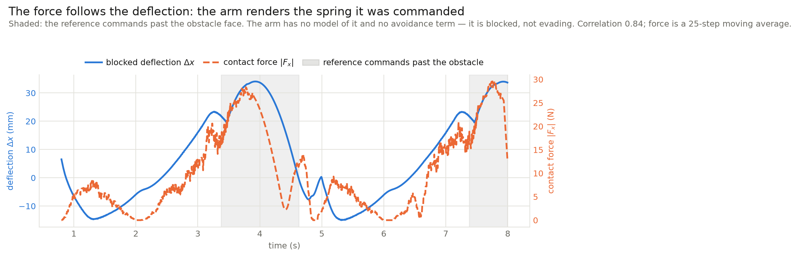
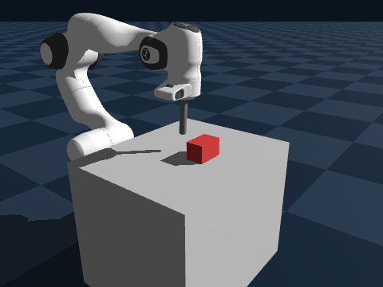
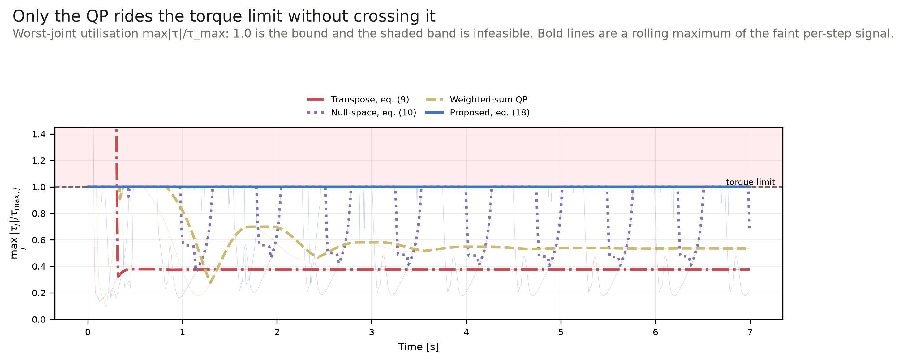
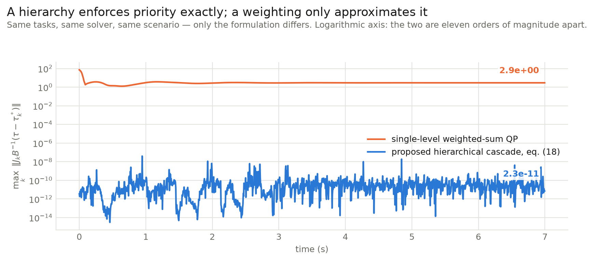
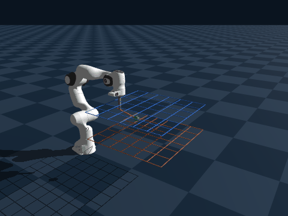

# Multi-Priority Cartesian Impedance Control (QP)

Reproduction and evaluation of the hierarchical, QP-based Cartesian impedance controller of

> **Multi-Priority Cartesian Impedance Control Based on Quadratic Programming Optimization**
> Enrico Mingo Hoffman, Arturo Laurenzi, Luca Muratore, Nikos G. Tsagarakis, Darwin G. Caldwell
> *IEEE ICRA 2018* — [DOI: 10.1109/ICRA.2018.8462877](https://doi.org/10.1109/ICRA.2018.8462877)

on a 7-DOF Franka Emika Panda in the [Genesis](https://github.com/Genesis-Embodied-AI/Genesis)
simulator.

**Jeffrey Kenny** (jeffrey.kenny@tum.de) · **Lars Dellmann** (lars.dellmann@tum.de)  
Advanced Robot Control and Learning, Technical University of Munich, Summer Semester 2026

---

## What this shows

An arm has to render several impedance behaviours at once, on joints with finite torque, and those
requirements conflict. Classical operational-space control expresses the task hierarchy as a
*weighting* and imposes actuator limits by *clipping* the computed torque, which discards the
ordering that produced it. In the QP formulation both become **constraints**: the priority order is
a hard equality carrying each level's optimum forward, and the torque limits are bounds on the
decision variable.

**The point is not that it tracks better. It is that the hierarchy and the torque limits stop being
things you approximate and become things the solver satisfies.**

| | Proposed cascade | Best classical rival |
| :--- | ---: | :--- |
| Priority-0 tracking RMSE | 0.3981 m | 0.4128 m — a 3.6 % wash |
| Torque-limit violations | **0** | 13 for the transpose law; the null-space law stays feasible only by clipping on 32.4 % of steps |
| Priority residual | **4·10⁻⁸** | 72.1 — weighted-sum QP, identical tasks and solver |
| Torque chatter | 13,355 N·m/s | **351** — 38× smoother |
| Solve time | 415 µs | **95 µs** — 4.4× cheaper |

Read the table top to bottom: accuracy is a wash, the guarantees are a landslide, and the price is
real. That is the whole argument, and it is written up in the project report.

Every number here was measured on 6–7 September 2026 on the `daqp` solver, and each is reproducible
from the commands below.

---

## Quickstart

```bash
uv venv && source .venv/bin/activate     # Windows: .venv\Scripts\activate
uv pip install -e .
```

Always run through `uv run`, which pins Genesis to the committed `uv.lock`.

```bash
# 1. The conflict scenario: three ranked objectives that cannot all be satisfied
uv run python main.py --no-vis --exp conflict --priority-order xyz --time 7

# 2. The same task stack under all four controllers
uv run python main.py --no-vis --exp compare --scenario conflict --time 7

# 3. Compliance against an obstacle the controller has no model of
uv run python main.py --no-vis --exp blocked_circle

# Regenerate the report figures (needs the telemetry from the runs above)
uv run python main.py --no-vis --exp compare --scenario conflict --time 7
uv run python main.py --no-vis --exp blocked_circle --out results/fig_blocked_circle.npz
uv run python scripts/make_report_figures.py
```

`results/` is not tracked, so the figure script reads telemetry the runs above produce. Two of the
six inputs it can read (`fig_corridor_*.npz`, `fig_singularity.npz`) back figures that are no longer
in the report and have no CLI producer yet.

Drop `--no-vis` for the 3D viewer.

---

## The three results

These mirror the three questions the report's evaluation asks, in the same order.

### 1 · Does the arm render the commanded impedance? — `blocked_circle`

```bash
uv run python main.py --no-vis --exp blocked_circle
```

An obstacle the controller knows nothing about blocks a commanded circular path. In steady contact
the exerted force should equal the commanded stiffness times the deflection the task sees.

| Commanded `kp` [N/m] | Δx [mm] | F_x [N] | Rendered K [N/m] | ratio |
| ---: | ---: | ---: | ---: | ---: |
| 300 | 35.4 | 15.2 | 428 | 1.43 |
| 600 | 23.9 | 17.6 | 739 | 1.23 |
| 1200 | 16.2 | 22.9 | 1418 | 1.18 |

The sweep is the point: a single operating point would only show that *some* force appears. Across a
fourfold range the arm reproduces a *commanded* impedance. Surface friction was the obvious
contaminant and was tested — varying the normal press 12.5× moves the ratio only 9 %, so friction
explains almost none of the excess.

This run also answers something the paper does not address: the priority guarantee bounds the QP
solution, but says nothing about forces the controller never modelled. Measured through the
collision, the residual holds at **1.4·10⁻¹⁴** — machine precision, and six orders *tighter* than in
the free-space conflict scenario. Contact does not disturb the hierarchy; a heavily active
constraint set does.

**Caveat.** The arm is consistently ~20 % over-stiff. We narrowed the cause (not friction) but did
not isolate it — most plausibly the damping term plus a contact normal off the task axis.



The sweep table shows the relationship holds across a range of commanded stiffnesses; this shows it
holding *moment to moment*. As the circular path presses the tool into the obstacle the deflection
grows and the force grows with it; as the path curves away, both fall together. That covariation is
`f = KΔx` observed directly rather than inferred from endpoints.

<p align="center">
  
</p>

The red block is the obstacle, and the controller has no knowledge of it — no avoidance term, no
collision model, nothing in the task stack refers to it. **Watch the tool tip run into it and stop
short**, holding against it rather than forcing through or being knocked off. Reproduce with:

```bash
uv run python main.py --exp blocked_circle --record docs/media/blocked_circle.gif --time 10
```

### 2 · Does the promise hold when the motors saturate? — `compare`

```bash
uv run python main.py --no-vis --exp compare --scenario conflict --priority-order xyz --time 7
```

The same task stack under four controllers, reproducing Figs. 1, 2 and 4 of the paper. This is where
the Dietrich null-space method enters as the classical baseline the assignment suggests.

| Controller | P0 RMSE [m] | Clipped | Violations | Max overshoot |
| :--- | ---: | ---: | ---: | ---: |
| **Hierarchical QP, eq. (18)** | **0.3981** | **0 %** | **0** | **0.00 N·m** |
| Weighted-sum QP | 0.4128 | 0 % | 0 | 0.00 N·m |
| Null-space projection, eq. (10) | 0.4084 | **32.4 %** | 0 | 0.00 N·m |
| Classical transpose, eq. (9) | 0.5627 | — | 13 | **59.86 N·m** |

The two projection laws fail differently, and the distinction is the paper's own argument:

- The **transpose law** has no saturation stage at all, so it simply leaves the feasible set, by
  59.86 N·m. That is the paper's Fig. 1.
- The **null-space law** does stay inside the bounds — but only by clipping the torque it computed
  on a third of the steps, which discards the optimality and the ordering that produced it. That is
  the paper's Fig. 2, and it is the reason the limits belong *inside* the optimization.



Utilisation is `max_j |τ_j| / τ_max,j`, so unity *is* the bound and the shaded region is infeasible.
The proposed cascade rides the limit continuously without crossing it; the transpose law leaves the
feasible set; the weighted-sum QP never uses the budget available to it.

**Caveat, and it matters.** The tracking advantage over the weighted-sum QP is **3.6 %** — within
what re-tuning either controller would produce. Do not read this table as "the QP tracks better". It
tracks about the same and is the only one that stays feasible without discarding its own solution.

### 3 · Does the promise hold when the tasks conflict? — `conflict`

```bash
uv run python main.py --no-vis --exp conflict --priority-order xyz --time 7
uv run python main.py --no-vis --exp conflict --priority-order zyx --time 7
```

Three one-dimensional Cartesian objectives compete for a target at 1.51 m, beyond the measured
reachable radius of 1.267 m, so the ranking alone decides which is sacrificed. This one run carries
most of the report: requirements 2, 3, 4, 5 and 7.

| What | Measured |
| :--- | :--- |
| Priority residual `‖J_k B⁻¹(τ − τ*_k)‖` | **4.0·10⁻⁸** — against **72.1** for a weighted-sum QP solving the identical tasks with the identical solver |
| Priority swap | `x>y>z` → x 0.3733 / z 0.3236 &nbsp;·&nbsp; `z>y>x` → x 0.4609 / z **0.0000** |
| Torque-limit violations | **0** in 1,400 steps, at a tolerance of 1·10⁻⁴ N·m, with no clipping |
| Constraint *activity* | ≥1 joint on a bound in **92.5 %** of steps |

The residual is the number that matters. It is what separates a hierarchy from a weighting.



**Note the logarithmic axis.** The cascade holds a median residual of 1.9·10⁻¹¹, at solver
tolerance; the weighted-sum QP sits near 2.9, meaning it silently trades priority-0 accuracy away
whenever its weights favour doing so. This is the clearest single piece of evidence that the
hierarchy is enforced as a constraint rather than approximated by a cost.

The activity figure is separate from the violation count on purpose: zero violations is equally
consistent with "the limits worked" and "we never went near them", and only the second number tells
them apart.

<table>
<tr><th><code>--priority-order xyz</code></th><th><code>--priority-order zyx</code></th></tr>
<tr>
<td></td>
<td></td>
</tr>
<tr>
<td>Reach is prioritised: the arm commits further forward and lets the tip sag below the commanded height.</td>
<td>Height is prioritised: the tip holds the commanded z exactly and gives up reach instead.</td>
</tr>
</table>

**Caveat.** Priority does not make an unreachable task reachable. x still fails by 0.3733 m even at
the top of the stack; what the ranking buys is 0.3733 instead of 0.4609. The asymmetry is itself
informative: under `x>y>z` the top task is the unreachable one, so it never settles and the null
space it hands down is small and constantly moving, which is why z cannot settle either.

### Two supporting results

**`corridor` — the general inequality row of eq. (18).** Everything above exercises the QP's cost
and its box bounds on τ. Only this run uses `b_l ≤ Aτ ≤ b_u`. A height corridor z ∈ [0.35, 0.55] m
is imposed while a circular reference deliberately commands heights outside it.

| Configuration | Max excursion beyond the corridor |
| :--- | ---: |
| Hierarchical QP (hard inequality) | **0.01 mm** |
| Null-space, eq. (10) (barrier fallback) | 15.07 mm |
| Transpose, eq. (9) (barrier fallback) | 20.64 mm |
| **Constraint ablated entirely** | **84 mm** |

The ablation row is what makes the rest meaningful — without it, "the tool stayed inside" could just
mean the trajectory did. Stiffening the barrier 33× narrows the gap to 0.92 mm, but only by
commanding **103.5 N·m against an 87 N·m limit**. A penalty gives you accuracy *or* feasibility and
lets you trade between them; the QP satisfies both, because both are constraints.

*Caveat:* the control barrier function filling eq. (18)'s constraint slot is ours, not the paper's,
and it drops the convective `J̇q̇` term because Genesis exposes no `J̇`. The 0.01 mm is an empirical
result, not a proof of a strict bound.

<p align="center">
  
</p>

**`benchmark` — real-time cost.** The two-level cascade solves in **415 µs** mean and **1.34 ms**
worst case against a 5 ms control period. Read this as a cost rather than a headline: it is **4.4×**
the 95 µs needed to evaluate the classical dynamically consistent pseudo-inverse on the same
problem. That is the price of solving instead of inverting.

---

## How it works

The four equations that matter, numbered as in the paper. The full derivation is in the project
report.

**Removing the pseudo-inverse.** The natural cost `min ‖J̄ᵀτ − f‖²` needs the dynamically
consistent pseudo-inverse `J̄ = B⁻¹Jᵀ(JB⁻¹Jᵀ)⁻¹`, which is exactly what becomes ill-conditioned
near singularities. Expanding it and applying the optimality condition, `J̄` cancels:

$$\min_{\tau}\ \lVert J B^{-1}\tau - J B^{-1} J^{T} f\rVert^{2} \qquad (16)$$

Nothing is inverted. The solver picks among the solution family instead of a projection fixing it
in advance.

**Priority as a hard equality.** At level `i`, with `i = 0` highest:

$$\min_{\tau_i}\ \lVert J_i B^{-1}\tau_i - J_i B^{-1}J_i^{T} f_i\rVert^{2} + \epsilon\lVert\tau_i\rVert^{2}
\quad \text{s.t.}\quad J_j B^{-1}\tau_i = J_j B^{-1}\tau_j^{*}\ \ \forall j<i \qquad (17,18)$$

The equality does not *penalise* deviation from the higher-priority solution, it *forbids* it.
Because it acts on `J_j B⁻¹τ` rather than on `τ`, it pins only the `m_j` task directions of level
`j` and leaves the remaining `n − m_j` free, which is what preserves redundancy down the cascade.

**Torque limits as bounds.** Any feed-forward added after the QP must be subtracted from the budget
inside it:

$$\tau_{\min} - h(q,\dot q) \le \tau \le \tau_{\max} - h(q,\dot q), \qquad
\tau_{d} = \tau_{opt} + h(q,\dot q) \qquad (19\text{–}21)$$

so adding `h` back lands inside `[τ_min, τ_max]` by construction. **No clipping is applied anywhere
in the controller.**

**Task forces** are the virtual impedance wrench `f_i = K_i(x_{d,i} − x_i) − D_i ẋ_i`, eq. (22).
A one-dimensional Cartesian objective is `CartesianPoseTask(axes=[0])` for x, `[1]` for y, `[2]` for
z — the decomposition Hoffman et al. use in §V-A.

---

## Repository layout

```
.
├── main.py                     # Entry point: control loop, scenario and experiment dispatch
├── run_all_experiments.py      # Batch runner for the 11 numbered experiments + solver benchmark
├── panda_cylinder.xml          # Franka Emika Panda 7-DOF MJCF model with a cylindrical tool
├── controllers/
│   ├── base_controller.py      # Common interface + feasibility telemetry
│   ├── qp_impedance.py         # Proposed: hierarchical QP cascade, eq. (18)
│   ├── weighted_qp.py          # Baseline: single-level weighted-sum QP
│   ├── saturated_algebraic.py  # Baseline: null-space projection + post-hoc clipping, eq. (10)
│   └── classical_transpose.py  # Baseline: Jacobian transpose, eq. (9)
├── solvers/
│   └── casadi_qp_solver.py     # Parametric CasADi QP (DAQP default; OSQP / qpOASES selectable)
├── tasks/
│   ├── cartesian_task.py       # 1-D / 3-D / 6-D Cartesian impedance objective
│   ├── posture_task.py         # Joint-space posture, lowest priority level
│   ├── force_task.py           # Normal-force objective + circular trajectory generator
│   ├── z_boundary_task.py      # Height corridor as a general QP inequality (or barrier fallback)
│   ├── apf_task.py             # Artificial potential field repulsion
│   └── task_stack.py           # Priority-ordered task stack
├── experiments/                # See "The three results" and "Further experiments" below
├── envs/genesis_sim.py         # Genesis wrapper + MuJoCo shadow model for the bias term h(q,q̇)
├── utils/math_utils.py         # Dynamically consistent pseudo-inverse, null-space projectors
├── scripts/
│   ├── make_report_figures.py  # Report and README figures
│   ├── plot_results.py         # Conflict-scenario comparison plots
│   └── probe_genesis.py        # Measured Genesis API facts (see docs)
└── docs/media/                 # Figures and clips used by this README
```

Genesis exposes no inverse-dynamics call, so the bias term `h(q,q̇) = C(q,q̇)q̇ + g(q)` is read from
a shadow MuJoCo model built from the same XML, and the MJCF actuator gains are zeroed so an internal
position servo does not fight the commanded torques.

---

## Running your own experiments

### Scenarios

`--experiment` (alias `--exp`) selects the scenario or benchmark. All use the same controller stack.

| Scenario | Priority levels | Reference | Purpose |
| :--- | :--- | :--- | :--- |
| `reach` | `cartesian (3-D) > posture` | reachable point | One Cartesian objective. Baseline. |
| `reach_split` | `x > y > z > posture` | the same reachable point | **Three Cartesian objectives at different priorities** (assignment requirement 2). Everything is satisfiable, so all three errors go to zero. |
| `conflict` | configurable, e.g. `x > y > z > posture` | `[1.30, 0.15, 0.75]` — **x out of reach**, y and z reachable | Objectives compete; the priority order decides who is sacrificed. |

`reach` and `reach_split` both converge to `0.0000 m`. That equivalence is the point of
`reach_split`: decomposing one 3-D objective into three ranked 1-D objectives reproduces the
undecomposed result exactly, which is only true if the cascade's priority constraints are correct.
Priority ordering has no *visible* effect there because nothing has to be given up — that requires a
conflicting reference, which is what `conflict` provides.

### CLI arguments for `main.py`

| Argument | Type | Default | Description |
| :--- | :--- | :--- | :--- |
| `--time` | `float` | `None` | Simulation duration in seconds. Each experiment supplies its own default. |
| `--dt` | `float` | `0.005` | Control timestep (200 Hz). |
| `--no-vis` | flag | `False` | Headless, no viewer window. |
| `--device` | `str` | `cpu` | Genesis backend (`cpu` or `gpu`). |
| `--solver` | `str` | `daqp` | QP backend: `daqp`, `osqp` or `qpoases`. |
| `--no-markers` | flag | `False` | Disable the goal, error-line, disturbance and trail overlays. |
| `--out` | `str` | `None` | Telemetry `.npz` destination. Each experiment supplies its own default. |
| `--record` | `str` | `None` | Record the run, e.g. `docs/media/run.gif`. |
| `--priority-order` | `str` | `xyz` | Axis ranking in `conflict`, highest first (`xyz`, `zyx`, ...). |
| `--experiment`, `--exp` | `str` | `reach` | See the table below. |
| `--scenario` | `str` | `None` | Scenario for `--exp compare`. **Ignored unless `--experiment` is left at its default.** |

Valid `--experiment` values: `reach`, `reach_split`, `conflict`, `compare`, `surface_circle`,
`blocked_circle`, `apf_avoidance`, `multilink_push`, `torque_wipe`, `singularity`,
`baseline_comparison`, `bode`, `passivity`, `robustness`, `corridor` (aliases `z_bounds_circle`,
`exp11`), `gain_sweep`, `chatter_mitigation`, `benchmark`, `all`.

`--slack-weight`, `--torque-rate-weight` and `--max-torque-rate` are currently parsed but not read
by any downstream code.

### Viewer overlays

With the viewer open the simulation draws a green goal sphere, an amber error line whose **length is
the tracking error**, a red disturbance arrow while an external force acts, and a fading cyan trail
of the tool path. Turn them off with `--no-markers`.

Overlays are viewer-only and are skipped entirely in headless runs, so telemetry is unaffected. The
goal marker is massless and collision-free; the rest are debug-draw overlays. Verified by comparing
headless runs with markers on and off, which produce identical results.

---

## Further experiments

Beyond the runs behind the report, the repository contains several further experiments. Their common
purpose is to see **how the controller behaves when something gets in its way**: a constraint that
binds, an obstacle it never modelled, a disturbance applied mid-motion, or a configuration where the
Jacobian degrades. None is required by the assignment and none is cited in the report. They exist
because a controller that has only been run in free space has not really been tested.

```bash
uv run python run_all_experiments.py --quick --device cpu    # all of them, reduced durations
uv run python main.py --exp <name>                           # one of them
```

| Experiment | What it puts in the way | Status |
| :--- | :--- | :--- |
| `surface_circle` | a surface to press on while tracking a circle | works |
| `apf_avoidance` | an obstacle, avoided by a repulsive field at top priority | works |
| `multilink_push` | 40 N disturbances at the elbow and the hand, mid-motion | the `hand` link name does not exist in this model, so the second push may be a no-op |
| `torque_wipe` | tightened ±20 N·m bounds during a wiping motion | **the bounds never engage** — measured max ‖τ‖ is 15.3 N·m |
| `singularity` | a target far enough out to drive the Jacobian toward rank deficiency | see the note below |
| `baseline_comparison` | an "unreachable" XY target under four controllers | **superseded** — the target is in fact reachable, so nothing conflicts; use `compare` instead |
| `bode` | sinusoidal references from 0.25 to 3 Hz | works |
| `passivity` | a 50 N push, with energy and power tracked through it | works |
| `robustness` | 35 % inertia error, an unmodelled payload, and velocity noise | works |
| `gain_sweep` | stiffness, damping ratio and torque-limit scaling swept | works |
| `chatter_mitigation` | soft priority and a torque-rate penalty, against strict eq. (18) | works |

Three of these claim more than they deliver, and the status column above says so rather than
quietly hiding it. Each was found by measuring instead of reading, and each would otherwise have
gone into the report unchallenged.

### A note on `singularity`

Driving the arm into a near-singular configuration, the proposed controller reaches
σ_min = 2.6·10⁻⁴ with every torque inside its bound. It is included for what it **fails** to show.
The paper attributes the jitter of its Figs. 1–3 to classical laws inverting **J** near
singularities without damping. We could not reproduce that: our transpose law computes `τ = Jᵀf` and
inverts nothing, so it has no singularity to degrade at, while the null-space projection we
implemented both damps its pseudo-inverse and clips its output — which suppresses precisely the
effect in question. Demonstrating the original claim would need an undamped, unclipped variant that
does not exist here.

---

## Telemetry and verification

Every run logs per-step telemetry to a compressed `.npz` under `results/`: time, joint torques and
their bounds, end-effector and reference positions, per-task errors, solver name, QP failure count,
and the priority residuals.

**No post-hoc clipping is applied to the controller output.** Eqs. (19)–(21) already guarantee
feasibility, so instead of enforcing it the controller *measures* it, via `n_violations`, `n_solves`
and `max_violation`. Clipping would mask any bug that broke the guarantee.

Strict priority is likewise measured rather than assumed. After each solve,
`QPImpedanceController.priority_residuals[k]` holds

$$\left\lVert J_k B^{-1}\tau_{final} - J_k B^{-1}\tau_k^{*} \right\rVert$$

— how far the final solution drifted from what priority level `k` had already decided.

| Property | Result |
| :--- | :--- |
| Torque-limit violations, `conflict` | **0 / 1400 steps**, tolerance 1·10⁻⁴ N·m |
| Priority residual, worst level | **4.0·10⁻⁸** (daqp) · **7.8·10⁻¹¹** (qpOASES) |
| Priority residual, level 0 only | 2.3·10⁻⁹ (daqp) · 1.1·10⁻¹² (qpOASES) |
| Weighted-sum QP, same tasks and solver | **72.1** |

Quote the **worst-level** figure, not the level-0 one: the residual grows down the cascade as each
level inherits the accumulated constraint error of the levels above, so the worst level is the
honest number.

### A note on the solver

The paper uses qpOASES; the default here is **DAQP**. Both give zero torque violations on the
conflict scenario, and the trade-off is real:

| | DAQP | qpOASES |
| :--- | ---: | ---: |
| Worst priority residual | 3.98·10⁻⁸ | **7.84·10⁻¹¹** |
| QP failures | **0** | 22 / 1400 (1.6 %) |

qpOASES enforces the hierarchy roughly 500× more tightly but fails on 1.6 % of QPs under a heavily
active constraint set; DAQP never fails. Select with `--solver`.
